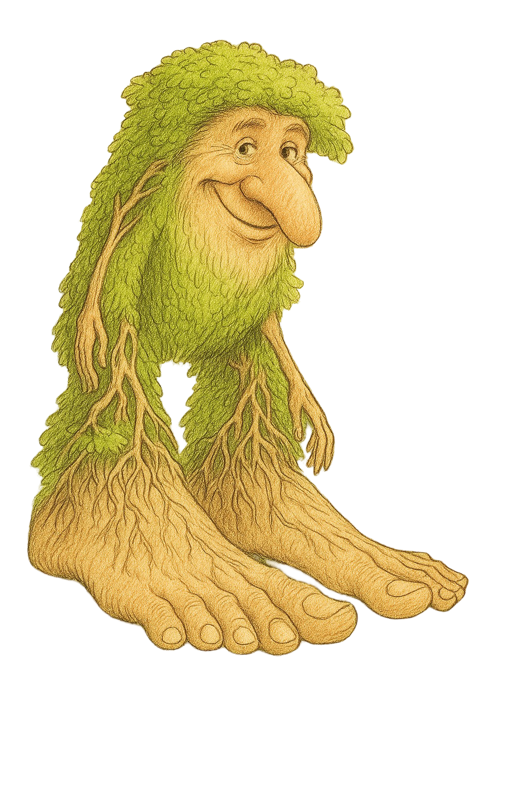

# Patapim

**Patapim** to eksperymentalny, interpretowany język programowania rozwijany w ramach działalności koła naukowego **Langos**.  
Jego głównym celem jest umożliwienie członkom koła łatwego poznania zasad projektowania i implementacji języków programowania.

Projekt jest w fazie wstępnej – wiele decyzji dotyczących składni, semantyki i funkcji jest jeszcze przed nami.  
Dołączając do rozwoju Patapim, masz realny wpływ na to, jak będzie wyglądał.
 

---

## 🎯 Cele projektu

Patapim ma służyć przede wszystkim jako:

- **Język dydaktyczny** – prosty do nauki i łatwy do modyfikacji.
- **Platforma do eksperymentów** – uczestnicy będą mogli dodawać nowe konstrukcje językowe, optymalizacje czy rozszerzenia.
- **Narzędzie integrujące** – projekt ma zachęcać do współpracy osób zainteresowanych teorią i praktyką tworzenia języków.

---

## 🚧 Status projektu

- **Etap:** Projekt jest na wczesnym etapie rozwoju — skupiamy się na tworzeniu fundamentów języka oraz podstawowej architektury interpretera i parsera.

---

## 💡 Jak możesz się zaangażować?

Ponieważ projekt dopiero startuje, każda pomoc się liczy. Dołącz do KN Langos!
Możesz:

- Wziąć udział w spotkaniach projektowych koła **Langos**.
- Zgłaszać propozycje:
  - podstawowych konstrukcji językowych,
  - inspiracji z istniejących języków,
  - koncepcji implementacyjnych.
- Pomagać w tworzeniu dokumentacji i przykładowych programów.
- Opracować logo lub materiały promocyjne Patapim.
- Udzielać się w dyskusjach i code review.

---

## 🧭 Kierunki rozwoju

Poniższe pomysły są wstępne i mogą ulec zmianie:

- Minimalistyczna, czytelna składnia

---

## 📫 Kontakt i współpraca

Chcesz dowiedzieć się więcej albo dołączyć?

Napisz do nas:  
📧 **tu w przyszłości pojawi się adres email koła**  
🌐 **tu w przyszłości pojawi się adres strony koła**

---

## 📝 Licencja

Licencja projektu zostanie określona w późniejszym etapie.

---

**Dołącz do tworzenia Patapim i razem stwórzmy coś wyjątkowego! 🚀**
